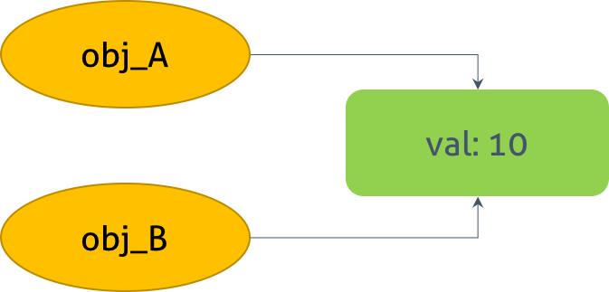
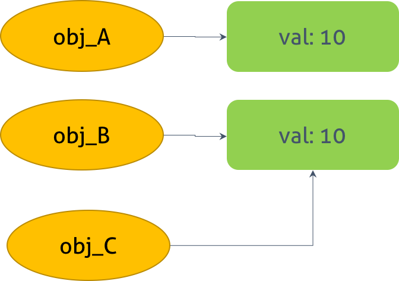
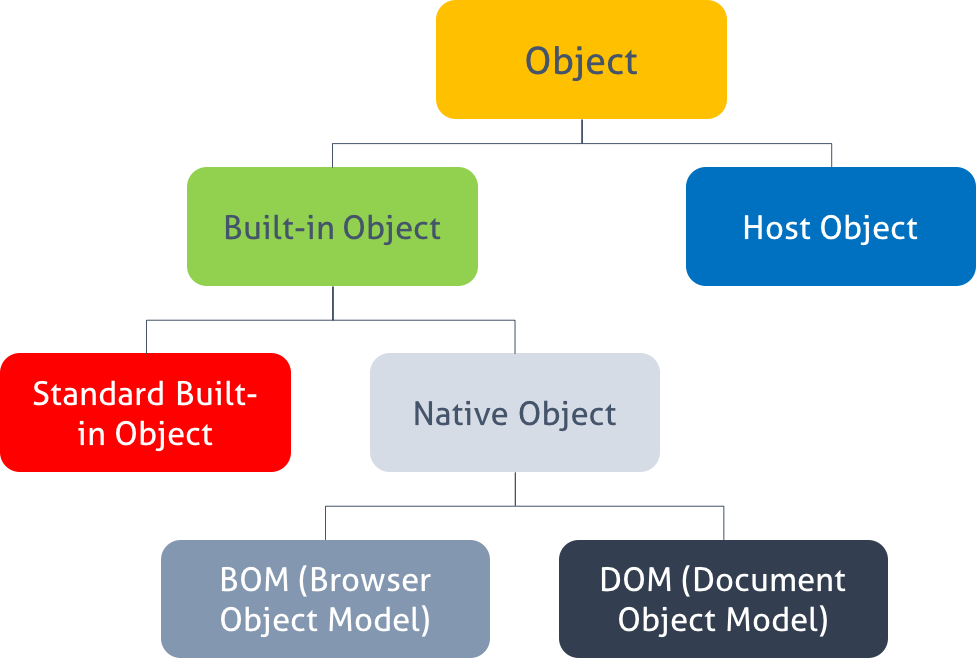

[← Back](README.md)

## 자바스크립트 객체(Object)

객체는 데이터와 그 데이터에 관련되는 동작(절차,방법,기능)을 모두 포함할 수 있는 개념적 존재이다. 달리 말해, 이름과 값을 가지는 데이터를 의미하는 속성(property)와 동작을 의미하는 메서드(method)를 포함하고 있는 독립적 주체이다.

객체는 데이터를 한 곳에 모으고 구조화하는데 유용하다. 객체 하나는 다른 객체를 포함할 수 있기 때문에, 그래프나 트리와 같은 자료구조를 쉽게 표현할 수 있다.

자바스크립트는 객체(object)기반의 스크립트 언어이며 자바스크립트를 이루고 있는 거의 “모든 것”은 객체이다. 기본자료형(Primitives)을 제외한 나머지 값들(배열, 함수, 정규표현식 등)은 모두 객체이다.

객체는 이름(name)과 값(value)의 쌍인 속성들을 포함하는 컨테이너라고 할 수 있다.
- 속성명 : 빈 문자열을 포함하는 문자열과 숫자
- 속성값 : undefined을 제외한 모든 값

메서드는 객체에 제한되어 있는 함수를 의미한다. 즉 속성값이 함수일 경우, 일반 함수와 구분하기 위해 메서드라 칭한다.

### 1. 객체 생성 방법

자바에서는 클래스를 사전에 정의하고 필요한 시점에 `new` 연산자를 사용하여 인스턴스를 생성하는 방식으로 객체를 생성한다. 하지만 자바스크립트는 클래스라는 개념이 없고(ECMAScript 6에서 새롭게 클래스가 도입되었다.) 별도의 객체 생성 방법이 존재한다.

#### 1.1 객체 리터럴

객체를 생성하는 가장 일반적이고 간편한 자바스크립트의 객체 생성 방식이다.
중괄호(`{}`)를 사용하여 객체를 생성하는데 `{}` 내에 아무것도 기술하지 않으면 빈 객체가 생성된다. `{}` 내에 1개 이상의 속성명(`Property name`): 속성값(`Property value`)을 기술하면 해당 속성이 추가된 객체를 생성할 수 있다.
속성명에는 문자열과 숫자가 올 수 있다. 그리고 속성값은 `undefined`을 제외한 모든 값과 표현식이 올 수 있으며 속성값이 함수인 경우 이를 메서드라 한다.
속성명의 따옴표(`““`)는 자바스크립트에서 사용할 수 있는 유효한 이름이고 예약어가 아닌 경우 생략할 수 있다.

```js
var emptyObject = {};
console.log(typeof emptyObject); // object

var person = {
  name: 'Lee',
  gender:'male',
  sayHello: function(){
    alert('Hi! my name is ' + this.name);
  }
};

console.log(typeof person);
console.log(person);

person.sayHello();
```

#### 1.2 Object() 생성자 함수

`new` 연산자와 `Object()` 생성자 함수를 사용하여 빈 객체를 생성할 수 있다. 빈 객체 생성 이후 속성과 메서드를 추가하여 객체를 완성하는 방법이다.
객체가 소유하고 있는 속성에 새로운 값을 할당하면 속성값은 갱신된다. 객체가 소유하고 있지 않은 속성에 값을 할당하려고 하면 해당 속성과 값을 객체에 추가한다.

```js
var person = new Object();
person.name = 'Lee';
person.gender = 'male';
person.sayHello = function(){
  alert('Hi! my name is ' + this.name);
};

console.log(typeof person);
console.log(person);

person.sayHello();
```

반드시 `new` 연산자와 `Object` 객체 생성자 함수를 사용해야하는 것은 아니다. 빈 객체를 생성하는 방법은 객체 리터럴을 사용하는 것이 더 간편하다.

```js
var person = {};
person.name = 'Lee';
person.gender = 'male';
person.sayHello = function(){
  alert('Hi! my name is ' + this.name);
};
```

특별한 이유가 없다면 `Object()` 생성자 함수 방식은 그다지 유용해 보이지 않는다. 하지만 객체 리터럴 방식으로 생성된 객체는 결국 내장(Built-in) 함수인 `Object()` 생성자 함수로 객체를 생성하는 것을 단순화 시킨 것이다. 자바스크립트 엔진은 객체 리터럴로 객체를 생성하는 코드를 만나면 내부적으로 `Object()` 생성자 함수를 사용하여 객체를 생성한다는 뜻이다.

#### 1.3 생성자 함수

객체 리터럴 방식과 `Object()` 생성자 함수 방식으로 객체를 생성하는 것은 속성 값만 다른 여러개의 객체 생성에 불편이 있다.

```js
var person1 = {
  name: 'Lee',
  gender:'male',
  sayHello: function(){
    alert('Hi! my name is ' + this.name);
  }
};
var person2 = {
  name: 'Kim',
  gender:'female',
  sayHello: function(){
    alert('Hi! my name is ' + this.name);
  }
};
```

생성자 함수를 마치 객체를 생성하기 위한 템플릿처럼 사용하여 속성값이 다른 객체 여러 개를 간편하게 생성할 수 있다.

```js
function Person(name, gender) {
  this.name = name;
  this.gender = gender;
  this.sayHello = function(){
    alert('Hi! my name is ' + this.name);
  };
}

var person1 = new Person('Lee', 'male');
var person2 = new Person('Kim', 'female');

console.log('person1: ', typeof person1);
console.log('person2: ', typeof person2);
console.log('person1: ', person1);
console.log('person2: ', person2);

person1.sayHello();
person2.sayHello();
```

생성자 함수 이름은 일반적으로 대문자로 시작한다. 이것은 생성자 함수임을 인식하도록 도움을 준다.

속성 또는 메서드명 앞에 기술한 this는 생성자 함수로 생성될 인스턴스(instance)이다. 따라서 this에 연결되어 있는 속성과 메서드는 public이다.

생성자 함수 내에서 선언된 일반 변수는 private이다. 즉 생성자 함수 내부에서는 자유롭게 접근이 가능하나 외부에서 접근할 수 있는 방법이 없다.

```js
function Person(name, gender) {
  var married = 'yes';        // private
  this.name = name;           // public
  this.gender = gender;       // public
  this.sayHello = function(){ // public
    alert('Hi! my name is ' + this.name);
  };
}

var person = new Person('Lee', 'male');

console.log(typeof person);
console.log(person);

console.log(person.gender);  // 'male'
console.log(person.married); // undefined
```

자바스크립트의 생성자 함수는 말 그대로 객체를 생성하는 역할을 한다. 하지만 자바와 같은 객체지향 언어의 생성자 함수와는 다르게 그 형식이 정해져 있는 것이 아니라 기존 함수에 new 연산자를 붙여서 호출하면 해당 함수는 생성자 함수로 동작한다.

이는 반대로 생각하면 생성자 함수가 아닌 일반 함수에 new 연산자를 붙여 호출하면 생성자 함수처럼 동작할 수 있다. 따라서 일반적으로 생성자 함수명은 첫문자를 대문자로 기술하여 혼란을 방지하려는 노력을 한다.

`new` 연산자와 함께 함수를 호출하면 `this` 바인딩이 다르게 동작한다. 자세한 내용은 생성자 호출 패턴을 참조하기 바란다.

-

### 2. 객체 속성 접근

#### 2.1 속성명

속성명에는 문자열(빈 문자열 포함)과 숫자가 올 수 있다. 그리고 속성값은 undefined을 제외한 모든 값과 표현식이 올 수 있으며 속성값이 함수인 경우 이를 메서드라 한다.

속성명의 따옴표(`““`)는 자바스크립트에서 사용할 수 있는 유효한 이름이고 예약어가 아닌 경우 생략할 수 있다.

```js
var person = {
  "first-name": "Ung-mo",
  "last-name": "Lee",
  gender: "male",
  break: 1
};
```

속성명 `first-name`는 반드시 따옴표를 사용해야 하지만 `first_name`는 생략 가능하다. 이는 `first-name`은 자바스크립트에서 사용 가능한 유효한 이름이 아니라 `‘-‘` 연산자가 있는 표현식이기 때문이다.

#### 2.2 속성값 읽기

객체의 속성에 접근하려면 아래와 같이 두가지 방법을 사용한다.

- 마침표(`.`) 표기법
- 대괄호(`[]`) 표기법

```js
var person = {
  "first-name": "Ung-mo",
  "last-name": "Lee",
  gender: "male",
};

console.log(person);

console.log(person.first-name);    // NaN: undefined-name
console.log(person[first-name]);   // ReferenceError: first is not defined
console.log(person['first-name']); // 'Ung-mo'

console.log(person.gender);    // 'male'
console.log(person[gender]);   // ReferenceError: gender is not defined
console.log(person['gender']); // 'male'
```

속성명이 유효한 자바스크립트 이름이고 예약어가 아닌 경우 속성값은 마침표 표기법, 대괄호 표기법 모두 사용할 수 있다.

속성명이 유효한 자바스크립트 이름이 아니거나 예약어인 경우 속성값은 대괄호 표기법으로 읽어야 한다. 대괄호(`[]`) 표기법을 사용하는 경우, 대괄호 내에 들어가는 속성명은 반드시 문자열이어야 한다.

객체에 존재하지 않는 속성을 읽으려고 하면 `undefined`를 반환한다.

```js
var person = {
  "first-name": "Ung-mo",
  "last-name": "Lee",
  gender: "male",
};

console.log(person.age); // undefined
```

#### 2.3 속성값 갱신

객체가 소유하고 있는 속성에 새로운 값을 할당하면 속성값은 갱신된다.

```js
var person = {
  "first-name": "Ung-mo",
  "last-name": "Lee",
  gender: "male",
};

person['first-name'] = 'Kim';
console.log(person['first-name'] ); // 'Kim'
```

#### 2.4 속성 동적 생성

객체가 소유하고 있지 않은 속성에 값을 할당하려고 하면 해당 속성을 객체에 추가한다.

```js
var person = {
  "first-name": "Ung-mo",
  "last-name": "Lee",
  gender: "male",
};

person.age = 20;
console.log(person.age); // 20
```

#### 2.5 속성 삭제

`delete` 연산자를 사용하면 객체의 속성을 삭제할 수 있다.

```js
var person = {
  "first-name": "Ung-mo",
  "last-name": "Lee",
  gender: "male",
};

delete person.gender;
console.log(person.gender); // undefined

delete person;
console.log(person); // Object {first-name: "Ung-mo", last-name: "Lee"}
```

#### 2.6 for in 문

`for in` 문을 사용하면 객체에 포함된 모든 속성에 대해 루프를 수행할 수 있다.

```js
var person = {
  "first-name": "Ung-mo",
  "last-name": "Lee",
  gender: "male",
};

var prop;

for(prop in person)  {
  console.log(prop + ': ' + person[prop]);
}
/*
first-name: Ung-mo
last-name: Lee
gender: male
*/
```

-

### 3. Pass-by-reference

기본자료형 `object`를 객체형 또는 참조형이라 한다. 참조형이란? 객체의 모든 연산이 실제 값이 아닌 참조 값으로 처리됨을 의미한다.
이에 반해 기본 자료형의 값은 값(value)으로 전달된다. 즉, 복사되어 전달된다. 이를 `pass-by-value`라 한다.

기본자료형은 값이 한번 정해지면 변경할 수 없지만(immutable), 객체는 변경 가능한 프로퍼티(속성)들의 집합이라 할 수 있다.

```js
// Pass-by-reference
var obj_A = {
  val: 10
}

var obj_B = obj_A;
console.log(obj_A.val, obj_B.val); // 10 10
console.log(obj_A === obj_B);      // true

obj_B.val = 20;
console.log(obj_A.val, obj_B.val); // 20 20
console.log(obj_A === obj_B);      // true
```

`obj_A` 객체를 객체 리터럴 방식으로 생성하였다. 이때 변수 `obj_A`는 객체 자체를 저장하고 있는 것이 아니라 생성된 객체의 참조값(address)를 저장하고 있다.

변수 `obj_B`에 변수 `obj_A`의 값을 할당하였다. 변수 `obj_A`의 값은 생성된 객체를 가리키는 참조값이므로 변수 `obj_B`에도 같은 참조값이 저장된다. 즉 변수 `obj_A`, `obj_B` 모두 동일한 객체를 참조하고 있다. 따라서 참조하고 있는 객체의 `val` 값이 변경되면 변수 `obj_A`, `obj_B` 모두 동일한 객체를 참조하고 있으므로 두 변수 모두 변경된 객체의 속성값을 참조하게 된다. 객체는 참조(Reference) 방식으로 전달된다. 결코 복사되지 않는다.



아래의 경우는 위의 경우와 약간 차이가 있다.

```js
var obj_A = { val: 10 };
var obj_B = { val: 10 };

console.log(obj_A.val, obj_B.val); // 10 10
console.log(obj_A === obj_B);      // false

var obj_C = obj_B;

console.log(obj_C.val, obj_B.val); // 10 10
console.log(obj_C === obj_B);      // true
```

변수 `obj_A`와 변수 `obj_B`는 비록 내용을 같지만 별개의 객체를 생성하여 참조값을 할당하였다. 따라서 변수 `obj_A`와 변수 `obj_B`의 참조값은 동일하지 않다.

변수 `obj_C`에는 변수 `obj_B`의 값을 할당하였다. 결국 변수 `obj_`C와 변수 `obj_B`는 동일한 객체를 가리키는 참조값을 저장하고 있다. 따라서 변수 `obj_`C와 변수 `obj_B`의 참조값은 동일하다.



```js
var a = {}, b = {}, c = {}; // a, b, c는 각각 다른 빈 객체를 참조
console.log(a === b, a === c, b === c); // false false false

a = b = c = {}; // a, b, c는 모두 같은 빈 객체를 참조
console.log(a === b, a === c, b === c); // true true true
```

-

### 4. Pass-by-value

```js
// Pass-by-value
var a = 1;
var b = a;

console.log(a, b);    // 1  1
console.log(a === b); // true

a = 10;
console.log(a, b);    // 10  1
console.log(a === b); // false
```

변수 `a`는 기본 자료형인 `number type`의 1을 저장하고 있다. 기본 자료형의 경우 값이 복사되어 변수에 저장된다. 즉 참조형으로 저장되는 것이 아니라 값 자체가 저장되게 된다. 변수 `b`에 변수 `a`를 대입할 경우, 변수 `a`의 값 1은 복사되어 변수 `b`에 저장된다.
기본자료형은 값이 한번 정해지면 변경할 수 없다.(immutable)

-

### 5. Immutability in JavaScript

Immutability(변경불가성)은 함수형 프로그래밍의 핵심 원리이다. 뿐만 아니라, 객체 지향 프로그램을 위한 기능을 제공하고 있다
`object` type을 제외한 모든 data type은 한번 정해지면 변경이 불가능한 값 (immutable value)이다.
C 언어와는 다르게도, 문자열은 변경 불가능한 값 (immutable value) 이다. 이런 값을 “primitive values” 라 한다. (변경이 불가능하다는 뜻은 메모리 영역에서의 변경이 불가능하다는 뜻이다. 재할당은 가능하다)

```js
var statement = "I am an immutable value"; // String is an immutable value
var otherStr = statement.slice(8, 17);
console.log(otherStr);   // “immutable”
console.log(statement);
```

2행에서 Stirng 객체의 `slice()` 메서드는 statement 변수에 저장된 문자열을 변경하는 것이 아니라 사실은 새로운 문자열을 생성하여 반환하고 있다. 그 이유는 문자열은 변경할 수 없는 immutable value이기 때문이다.

```js
var arr = [];
console.log(arr.length); // 0

var v2 = arr.push(2);    // arr.push()는 연산 후 arr의 length를 반환
console.log(arr.length); // 1
```

상기 예제에서 v2의 값은 무엇인가? 문자열의 예와 같이 배열이 동작한다면 v2는 새로운 배열(하나의 요소를 가지고 그 값은 2인)을 가지게 될 것이다. 그러나 객체인 arr은 push 메서드에 의해 update되고 v2에는 배열의 새로운 `length` 값이 반환된다.

-

6. 객체의 분류

객체는 아래와 같이 분류할 수 있다.



[Built-in Object(내장 객체)]()는 웹페이지 등을 표현하기 위한 공통의 기능을 제공한다. 웹페이지가 브라우저에 의해 로드되자마자 별다른 행위없이 바로 사용이 가능하다. Built-in Object는 아래와 같이 구분할 수 있다.

- [Standard Built-in Objects (or Global Objects)]()
- [BOM (Browser Object Model)]()
- [DOM (Document Object Model)]()

`Standard Built-in Objects`(표준 빌트인 객체)를 제외한 `BOM`과 `DOM`을 `Native Object`라고 분류하기도 한다. 또한 사용자가 생성한 객체를 `Host Object`(사용자 정의 객체)라 한다.

#### Host Object(사용자 정의 객체)

사용자가 생성한 객체들이다. `constructor` 혹은 객체 리터럴을 통해 사용자가 객체를 정의하고 확장시킨 것들이기 때문에 Built-in Object 와 Native Object가 구성된 이후에 구성된다.
